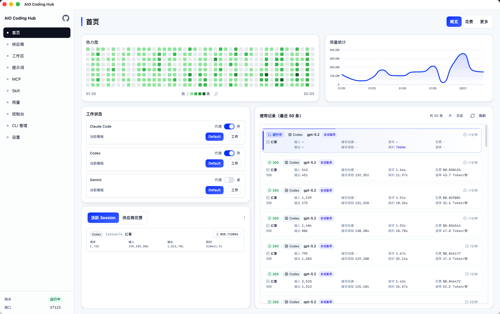
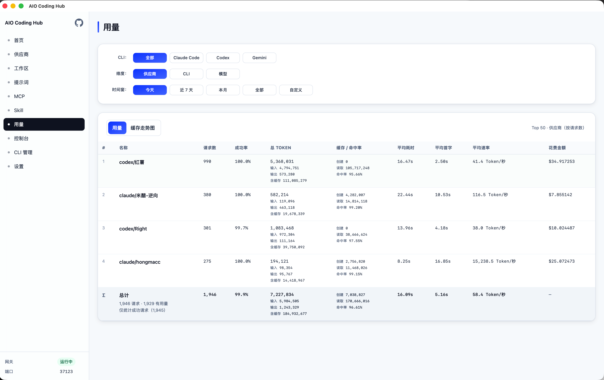
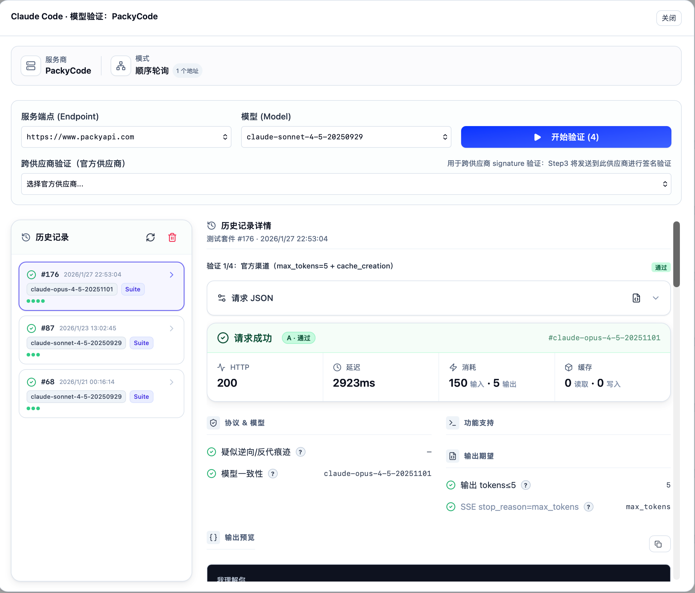

<div align="center">
  

# AIO Coding Hub

**本地 AI CLI 统一网关** — 让 Claude Code / Codex / Gemini CLI 请求走同一个入口

[](https://github.com/dyndynjyxa/aio-coding-hub/releases)
[](LICENSE)
[](#安装)

简体中文 | [English](./README_EN.md)

</div>

> **🙏 致谢**
> 本项目借鉴并参考了以下优秀开源项目理念：
> - [cc-switch](https://github.com/farion1231/cc-switch)
> - [claude-code-hub](https://github.com/ding113/claude-code-hub)
> - [code-switch-R](https://github.com/Rogers-F/code-switch-R)

---

## 为什么需要它？

| 痛点 | AIO Coding Hub 的解决方案 |
|------|--------------------------|
| 每个 CLI 都要单独配置 `base_url` 和 API Key | **统一入口** — 所有 CLI 走 `127.0.0.1` 本机网关 |
| 上游不稳定时请求直接失败 | **智能 Failover** — 自动切换 Provider，熔断保护 |
| 不知道请求去了哪里、用了多少 Token | **全链路可观测** — Trace 追踪、Console 日志、用量统计 |
| 切换 Provider 要改多个配置文件 | **一键代理** — 开关即切换，自动备份原配置 |

---

## 核心特性

### 🔀 统一网关代理
- 单一入口支持 Claude Code / Codex / Gemini CLI
- 自定义模型映射

### ⚡ 智能路由与容错
- 多 Provider 优先级排序，自动 Failover
- 熔断器模式 + 会话粘滞

### 📊 可观测性
- 请求 Trace、实时日志、用量统计
- 供应商限流监控与成本估算

### 🔍 渠道验证
- 多维度验证模板（token 截断、Extended Thinking）
- 批量验证与历史记录

### 🔐 安全与隐私
- 本地数据 + API Key 加密
- 开源可审计

---

## 产品截图

### 主界面 - 网关状态与会话管理



### 用量统计 - 包含Token、缓存率、耗时、花费



### CC 模型验证 - 渠道鉴别与多维度验证




---

## 架构概览

```
┌─────────────────────────────────────────────────────────────────┐
│                        AIO Coding Hub                           │
├─────────────────────────────────────────────────────────────────┤
│  ┌─────────┐   ┌─────────┐   ┌─────────┐                       │
│  │ Claude  │   │  Codex  │   │ Gemini  │  ← AI CLI Tools       │
│  │  Code   │   │   CLI   │   │   CLI   │                       │
│  └────┬────┘   └────┬────┘   └────┬────┘                       │
│       │             │             │                             │
│       └─────────────┼─────────────┘                             │
│                     ▼                                           │
│  ┌──────────────────────────────────────────────────────────┐  │
│  │              Local Gateway (127.0.0.1:37123)             │  │
│  │  ┌──────────┐  ┌──────────┐  ┌──────────┐  ┌──────────┐ │  │
│  │  │ Failover │  │ Circuit  │  │ Session  │  │  Usage   │ │  │
│  │  │  Engine  │  │ Breaker  │  │ Manager  │  │ Tracker  │ │  │
│  │  └──────────┘  └──────────┘  └──────────┘  └──────────┘ │  │
│  └──────────────────────────────────────────────────────────┘  │
│                     │                                           │
│       ┌─────────────┼─────────────┐                             │
│       ▼             ▼             ▼                             │
│  ┌─────────┐   ┌─────────┐   ┌─────────┐                       │
│  │Provider │   │Provider │   │Provider │  ← Upstream APIs      │
│  │    A    │   │    B    │   │    C    │                       │
│  └─────────┘   └─────────┘   └─────────┘                       │
└─────────────────────────────────────────────────────────────────┘
```

---

## 安装

### 从 Release 下载（推荐）

前往 [Releases](https://github.com/dyndynjyxa/aio-coding-hub/releases) 下载对应平台的安装包：

| 平台 | 安装包 |
|------|--------|
| **Windows** | `.exe` (NSIS) 或 `.msi` |
| **macOS** | `.dmg` |
| **Linux** | `.deb` / `.AppImage` |

<details>
<summary>macOS 安全提示</summary>

若遇到"无法打开/来源未验证"提示，执行：

```bash
sudo xattr -cr /Applications/"AIO Coding Hub.app"
```

</details>

### 从源码构建

```bash
# 前置：Node.js 18+、pnpm、Rust 1.70+
git clone https://github.com/dyndynjyxa/aio-coding-hub.git
cd aio-coding-hub
pnpm install
pnpm tauri:build

# 开发模式
pnpm tauri:dev

# 运行测试
pnpm test:unit           # 前端单元测试
pnpm test:unit:coverage  # 前端覆盖率门禁
pnpm tauri:test          # 后端测试

# 代码质量检查
pnpm check:precommit     # 快速预提交检查（前端 + Rust check）
pnpm check:precommit:full # 完整预提交检查（含格式全量校验 + clippy）
pnpm check:prepush       # 覆盖率 + 后端测试 + clippy（推送前）
```

---

## 快速开始

**3 步完成配置：**

```
1️⃣  Providers 页 → 添加上游（官方 API / 自建代理 / 公司网关）
2️⃣  Home 页 → 打开目标 CLI 的"代理"开关
3️⃣  终端发起请求 → Console/Usage 查看 Trace 与用量
```

**验证网关运行：**

```bash
curl http://127.0.0.1:37123/health
# 预期输出: {"status":"ok"}
```

---

## 技术栈

| 层级 | 技术 |
|------|------|
| **前端** | React 19 · TypeScript · Tailwind CSS · Vite |
| **状态管理** | TanStack Query (React Query) |
| **测试** | Vitest · Testing Library · MSW |
| **桌面框架** | Tauri 2 |
| **后端** | Rust · Axum (HTTP Gateway) |
| **数据库** | SQLite (rusqlite) |
| **通信** | Tauri IPC · Server-Sent Events |

---

## 质量保证

- **测试**: Vitest (前端) + Cargo test (后端)
- **检查**: TypeScript 严格模式 + Rust clippy
- **Hooks**: Pre-commit 增量格式化/快速检查 + Pre-push 覆盖率/后端测试/clippy
- **CI/CD**: GitHub Actions + Release Please

---

## 文档

| 文档 | 说明 |
|------|------|
| [使用指南](docs/usage.md) | 完整配置流程与网关入口说明 |
| [CLI 代理机制](docs/cli-proxy.md) | 配置文件变更与备份策略 |
| [数据与安全](docs/data-and-security.md) | 数据存储位置与安全提示 |
| [常见问题](docs/troubleshooting.md) | FAQ 与排障指南 |
| [开发指南](docs/development.md) | 本地开发与质量门禁 |
| [发版说明](docs/releasing.md) | 版本发布与自动更新 |

---

## 不适用场景

- 公网部署 / 远程访问 / 多租户
- 企业级 RBAC 权限管理

> 本项目定位为 **单机桌面工具 + 本地网关**，所有数据保存在本机用户目录。

---

## 参与贡献

欢迎提交 Issue 和 PR！项目采用 [Conventional Commits](https://www.conventionalcommits.org/) 规范。

```bash
# PR 标题格式
feat(ui): add usage heatmap
fix(gateway): handle timeout correctly
docs: update installation guide
```


---

## 许可证

[MIT License](LICENSE)

---

[](https://starchart.cc/dyndynjyxa/aio-coding-hub)


